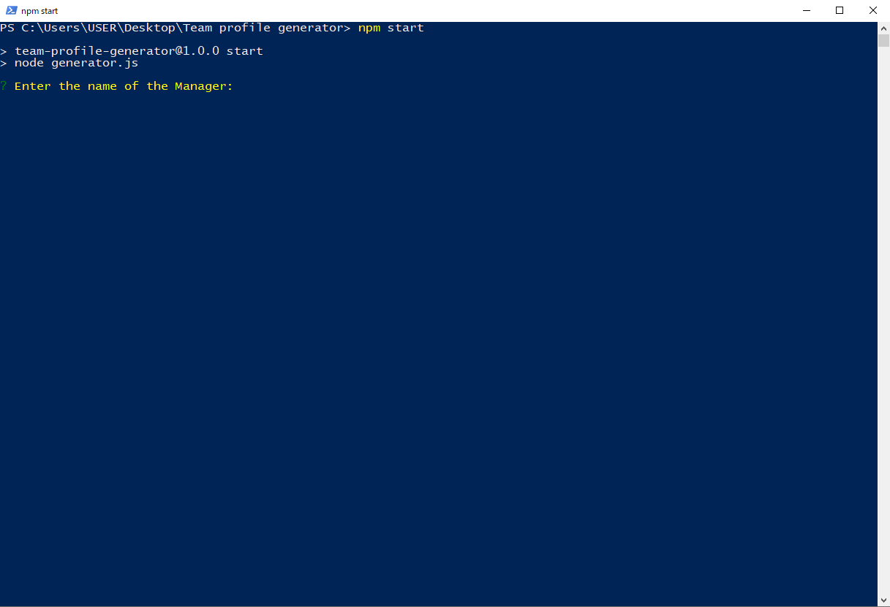
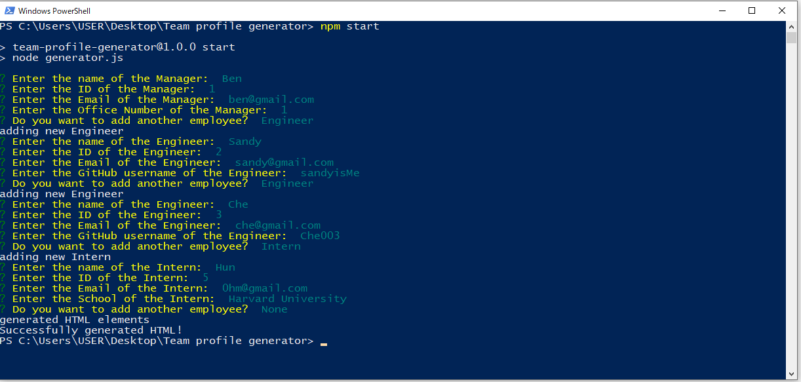
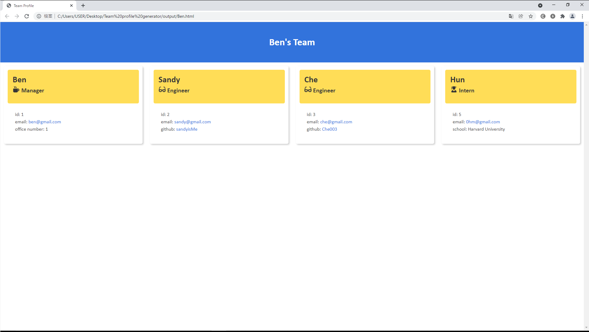

# README Generator

## Table of Content: 
* [Deploy link](#Deploy-link)
* [Description](#Description)
* [Installation](#Installation)
* [User Guide](#User-Guide)
* [Third Party Package](#Third-party-package-used)
* [Contact](#Contact)

## Deploy Link
https://github.com/Aurorachama/Team-profile-generator

## Description 

This is a command line application to generate a HTML page for Software Engineering team to display summaries of their team

## Installation 
***This application relies on node.js as its run-time enviornment. Please install node.js before using this application***

***For information about node.js : [Node.js](https://nodejs.org/)***
* Clone this project using git clone <url> or Download ZIP, then use a command line to  run ``` npm i ``` to install necessary packages (inquirer)

## User Guide 

* Once installation is finished, user can type 
``` 
node index.js
```
or 
``` 
npm start
```
to run the code. 

* Then, prompt of details about managers will be shown for users to type in their response

* After that, users can have the choice to add additional team members by engineer or Intern role

* If press none on the prompt means that the application will be finish, then

* A HTML file will be generated according to the response


## Third party package used
[Inquirer](https://github.com/SBoudrias/Inquirer.js)


## Screenshot
**Powershell is used to commence the application but other commend line works the same**


**Every question and the success message**


**The product and its path(inside the Output folder)**

## Demo
[](https://drive.google.com/file/d/1-x1BDy6rCSdkcbRTzMq5O7pRhC_M34sJ/view)
### Contact 

Github: [Aurorachama](https://github.com/Aurorachama)
